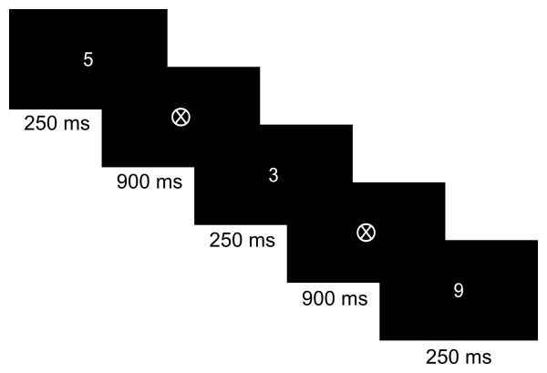

# Brainaccess-HALO-eeg-analysis

Sustained Attention to Response Task (SART)

PsychoPy 기반 숫자 Go/No-Go 실험입니다. `3`을 제외한 숫자에는 SPACE로 반응하고,
`3`에는 반응하지 않습니다. 숫자 250 ms + 마스크 900 ms를 사용합니다.



## 실행

프로젝트 폴더에서 PowerShell로 실행합니다. 설치된 환경은 Python 3.10 / PsychoPy 2026.2.4입니다.

```powershell
.\.venv\Scripts\python.exe -X utf8 python_sart.py --phase pre
.\.venv\Scripts\python.exe -X utf8 python_sart.py --phase post
```

실행 코드는 `python_sart.py` 하나로 통합되었습니다.
`--phase`를 생략하면 콘솔에서 pre/post를 묻습니다.
Windows에서 UTF-8 모드 없이 실행한 경우 진입점이 UTF-8 모드로 다시 실행되어,
한국어 PsychoPy 번역 JSON의 cp949 디코딩 오류를 방지합니다.

- PRE: 5회 반복 × 45 = 225 본 시행, 약 4분 19초 + 화면 갱신 지연.
- POST: 12회 반복 × 45 = 540 본 시행, 약 10분 21초 + 화면 갱신 지연.
- 기본값은 연습 없음, 무작위 순서, 카운트다운 사용입니다. 설정은 `python_sart.py` 상단에 있습니다.
- trial별 정오 피드백과 trial 사이 빈 화면 없이 숫자 → 원 안의 X 마스크 → 다음 숫자로 진행합니다.
- 참가자 정보의 빈 입력, 미선택 항목, 잘못된 나이/ID는 실험 시작 전에 검사합니다.
- B로 설명 화면을 진행하고, SPACE로 반응합니다. ESC는 진행 중인 실험을 중단합니다.
- 화면 창으로 실행하려면 `--windowed`, 저장 폴더를 지정하려면 `--output 경로`를 사용합니다.

## 결과 파일

기본 저장 위치는 **스크립트가 있는 폴더의 `experiment/`**입니다.
실행한 터미널의 현재 폴더와 관계없이 같은 위치에 저장합니다.

```text
experiment/
├─ raw/
│  ├─ 참가자_S세션_주제_조건_PRE_날짜시각_실행ID.csv
│  └─ 참가자_S세션_주제_조건_POST_날짜시각_실행ID.csv
└─ summary.csv
```

| 파일 | 한 행의 의미 | 저장 내용 |
| --- | --- | --- |
| raw/*.csv | 완료된 시행 하나, 실행마다 별도 파일 | 참가자 정보, session, condition/topic, run_id, phase, 연습 여부, 블록/시행 번호, 숫자/Go·No-Go, 반응 여부, 정오, RT, 글자 크기, 타이밍 |
| summary.csv | 실행의 분석 구간 하나 | 참가자/세션 정보, run_id, phase, 완료/중단/오류 상태, 실행 날짜, 설정, 원자료 파일 경로, 구간, 시행 수, 오류율, RT 지표 |

PRE, POST, 재실행마다 새 `run_id`와 원자료 파일을 만들므로 결과가 덮어써지지 않습니다.
각 원자료 행에 참가자/세션 정보를 함께 저장해 파일 하나만으로 분석할 수 있습니다.
실행 사이의 참가자 정보 변경은 각 실행에 입력된 값으로 기록되며 이전 파일을 수정하지 않습니다.
PRE/POST 비교 시 participant_id, session, condition/topic을 확인하고 run_id로 재실행을 구분하세요.
`summary.csv`의 `raw_file` 컬럼으로 해당 실행의 원자료 파일을 찾을 수 있습니다.

CSV는 Excel에서 한국어를 읽기 쉬운 UTF-8 BOM 형식입니다.
무응답 RT와 계산할 수 없는 지표는 빈 셀입니다. RT는 ms, 경과시간은 초입니다.
`accuracy`는 정답 1 / 오답 0, `responded`와 `is_practice`는 1 / 0입니다.

완료된 시행은 매번 해당 실행의 `raw/*.csv`에 기록하고 flush합니다.
ESC로 중단된 현재 시행은 저장하지 않으며, 이전에 완료된 시행은 유지합니다.
정상 종료 및 ESC/실행 오류 시 summary를 작성하고 화면을 닫습니다.
프로세스 강제 종료/전원 종료 시 summary 작성은 보장되지 않습니다.
한 저장 폴더에는 한 실험 프로세스만 실행하세요.
과거 TXT 및 이전 네 개 CSV 구조의 결과를 자동으로 변환하지 않습니다.
이전 형식의 summary.csv가 있으면 헤더 검사에서 중단합니다.
이 경우 `--output`으로 별도 폴더를 지정해 기존 결과와 분리해서 실행하세요.

## 지표와 시각 정의

- Go omission rate = Go 무응답 수 / 완료된 Go 시행 수 × 100.
- No-Go commission rate = No-Go 반응 수 / 완료된 No-Go 시행 수 × 100.
- Median/mean/SD/CV RT는 **정답 Go 반응**만 사용합니다. SD는 표본 표준편차입니다.
- Balanced accuracy는 Go 정확도와 No-Go 정확도의 평균입니다. 어느 쪽 시행이 없으면 빈 값입니다.
- 모든 요약에서 연습 시행은 제외합니다. 원자료에는 `is_practice=1`로 보관합니다.
- `summary.csv`의 `window=overall`을 선택하면 **실행당 한 행**입니다.
  `first_4min` 및 `time_bin_1`, `time_bin_2`, …에는 기존 4분/2분 구간 분석을 보관합니다.
  구간은 첫 본 시행의 자극 시작을 0초로 하며, 경계의 시행은 시작 시각으로 분류합니다.
  구간이 짧거나 실험이 중단된 경우 `is_partial`로 구분합니다.
- 실행 날짜/시각은 시간대가 포함된 UTC ISO 8601입니다.
- `stimulus_onset_elapsed_s`와 `trial_end_elapsed_s`는 실행 시작부터의 경과시간입니다.
  `*_perf_s`는 원시 `time.perf_counter()` 값이며 실제 날짜/시각이 아닙니다.
- RT 시계는 자극을 표시하는 `win.flip()` 콜백에서 초기화합니다.
  화면 자극과 EEG의 동기화 트리거는 아직 구현되지 않았습니다.
- 반응 제한은 자극 시작 후 1.15초입니다. 실제 자극/마스크 표시 시간에는 화면 갱신 지연이 포함될 수 있습니다.

## 검증

화면 없이 입력 검사, CSV 연결/누적 저장, 요약 계산, 반응 처리, 중단 저장을 검사합니다.

```powershell
.\.venv\Scripts\python.exe -X utf8 -m unittest discover -s tests -v
```

실제 Qt 입력창과 PsychoPy 화면을 자동으로 열고 닫는 짧은 통합 검증:

```powershell
.\.venv\Scripts\python.exe -X utf8 tests\gui_smoke.py
```

GUI 검증은 합성 키 반응과 임시 저장 폴더를 사용합니다.
화면 주사율, 실제 키보드 지연 또는 EEG 동기화 정확도의 검증을 대신하지 않습니다.

## Reference

Robertson, H., Manly, T., Andrade, J., Baddeley, B. T., & Yiend, J. (1997).
'Oops!': Performance correlates of everyday attentional failures in traumatic
brain injured and normal subjects. Neuropsychologia, 35(6), 747–758.

Original implementation: Cary Stothart (2015), Python SART (Version 2), MIT license.
The original copyright and license are retained in python_sart.py.
